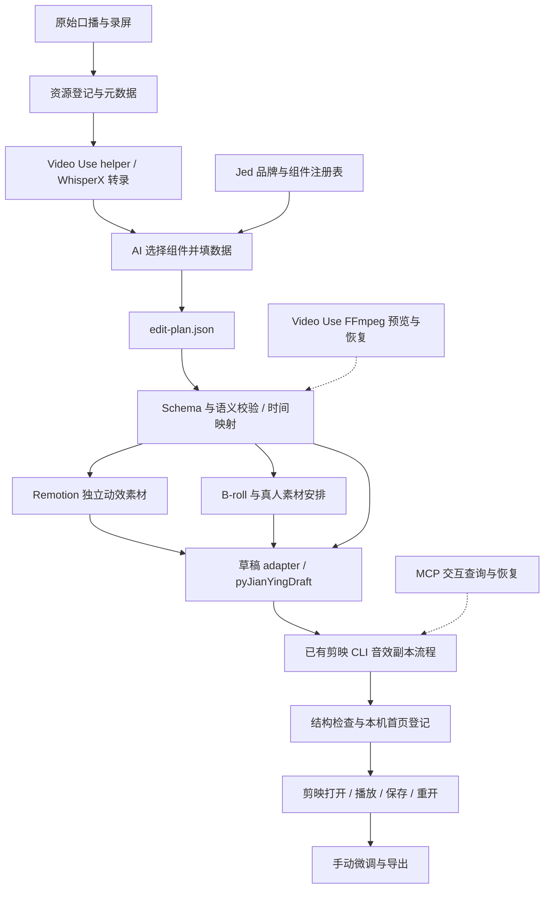

# Jed Video System：架构方案与实施路线

日期：2026-10-01。状态：第一轮视觉与客户intake已完成；第二轮已接通真实转录、统一时间计划、原声预览和隔离剪映草稿。应用播放与保存重开仍待验证。阶段产物见 [第一轮预览](preview-stage.md) 与 [真实闭环](production-pilot.md)。

## 1. 建议采用的方案

建立一个统一的 `jed-video-system` 插件，内部以本地总控模块负责品牌规则、组件注册、内容计划、时间映射、任务执行与验收。复用 Video Use 的转录 helper、Remotion 渲染、现有剪映桥接和音效插件；针对当前缺少的视频组装入口，增加调用已安装 pyJianYingDraft 的薄适配层。

AI 正常生产只做四件事：理解内容、选择已批准的组件、填入数据、确定时间。颜色、字体、几何布局和运动方式由库控制。

先验证“独立动效素材能在本机剪映稳定使用”和“新草稿能保存重开”，然后验收 Motion Gallery，再连接自动规划。这样不会在基础格式尚未验证时投入大量组件开发。

初次调查结果详见 [工具调查](tool-inventory.md) 与 [资源分析](resource-analysis.md)。初次调查只新增文档、采样图和工作总结。后续已授权阶段完成独立视觉预览与客户问询原型，进度见 [第一轮预览](preview-stage.md)；尚未创建剪映草稿或发布仓库。

## 2. 为什么目前不能直接串工具就完成

当前剪映 CLI 与 MCP 同属音效桥接项目，具备加密读取和副本音效编辑，但没有视频、图片、字幕的通用组装命令。已有 pyJianYingDraft 安装包含这些基础 API；它们仍需本机剪映 11.5 的独立验证。

因此，新项目里的草稿 adapter 是必要的集成工作。它不重写剪映引擎、codec、转录器或视频渲染器，只把 Jed 的计划翻译成现有库调用，并补上计划约束、结果登记和验证。

不能把 MCP 当作 CLI 缺少功能的天然替代品：本机两者的底层编辑能力相同。

## 3. 总体流程与责任边界



| 层 | 负责什么 | 不承担什么 |
| --- | --- | --- |
| Brand | 颜色、字体、间距、形状、阴影、动画 preset、布局保护区 | 每条视频临时设计 |
| Registry | 组件 / Scene 名称、版本、props Schema、适用内容、容量限制、支持布局 | 任意 JSX / CSS 代码输入 |
| Planner | 选组件、提炼文字、匹配来源、确定叙述落点 | 改品牌 token、发明数据、直接修改草稿 |
| Plan compiler | 源时间到输出时间、帧取整、cue 展开、任务依赖与能力检查 | 第二套自由剪辑策略 |
| Remotion adapter | 用同一组件库产出独立素材与预览 | 转录、B-roll 下载、原生剪映控制 |
| Draft adapter | 创建 / 组装已验证范围内的草稿与轨道 | 重写加密算法或绕过版本差异 |
| Existing Jianying CLI | 音效素材检索、prepare / build / verify / publish | 尚未提供的视频组装能力 |
| MCP / Sound Skill | 交互读取、声音指导、必要恢复 | 与 CLI 并行改同一工程 |
| Reviewer | 打开播放、检查可读性和声音、手动微调、导出 | 由 JSON 校验代替主观验收 |

第一版使用本地 TypeScript 总控、React/Remotion 组件、Python 草稿 worker。Python worker 优先运行在现有桥接 `.venv`，通过标准输入输出传 JSON；路径写入本机配置，不写死在公共代码里。不引入云端队列、账号系统或另一个视频编辑框架。

## 4. 可复用视觉系统

### 三层模型

1. `tokens`：颜色、字体、字重、圆角、边框、阴影、字号与间距。
2. `primitives/components`：标题、数字、条形图、截图卡等，只有内容和有限变体可改变。
3. `scenes`：组合多个组件的固定版式，定义保护区、插槽和局部时间安排。

每个 Scene 使用这些组件，不自行复制一套图表实现。组件动画全部由帧驱动，避免墙钟、随机数或联网数据导致 Gallery 与导出结果不一致。

### 组件范围

用户文档里的八个组件保留，同时补充参考片明显需要的两个组件：

| 组件 | props 内容 | 动效规则 / 边界 |
| --- | --- | --- |
| SectionTitle | 章节名、编号、短副标题 | 短入场、标题阅读停留；不默认做长片头 |
| KeyPointCard | 图标语义、标题、说明 | 按行增加，旧行保留；不强制每句一张卡 |
| BigNumber | 原始数值、单位、精度、标签、来源 | 数字递增，单位静止；没有真实数值不创建 |
| ComparisonBars | 各项名称/数值、单位、方向、比例尺、重点项 | 横条左到右、竖柱底到顶；条长和数字同步 |
| SourceCard | 标题、来源名、日期、URL、备注 | 可在图表出现时先建立来源，资料缺失显式标记 |
| ScreenshotCard | asset ID、裁切区域、标题、重点区域 | 固定窗口；图片内容不写死 |
| Timeline | 节点、时间标签、当前步骤 | 逐节点建立，连接线随讲解推进 |
| DataComparison | 指标、对照项、差值 / 比例 | 差值由数据计算；复用 ComparisonBars / BigNumber |
| ChapterProgress | 章节数组、当前章节、已完成项 | 长期导航；章节数不固定 |
| LineChart | 序列、轴、标注、比例尺、来源 | 从左到右绘制、注释分时出现；不编造数据点 |

`Timeline` 是信息图组件，不等于编辑器时间轴。`DataComparison` 是多指标组合组件，不重复实现底层条形图。

每个组件注册最大项数、文字容量和最小时长。超过容量时，planner 拆成两段或改用另一种已批准布局；不能自动把字号缩到看不清。

图表提供 `linear` 与必要的 `log` 比例尺。线性数量比较通常从零开始；跨多个数量级才使用明确标注的 log 轴。数字增长是展示过程，最终值和单位保持准确。

### 第一批 Scene

- `TalkingHeadInsight`：人物底片＋观点 / 大数字＋来源。
- `TalkingHeadComparison`：人物底片＋侧边比较图＋结论。
- `EvidenceExplainer`：底片＋来源截图＋图表 / 解释。
- 后续 `ScreenDemoFrame`：大录屏窗口＋圆形人物＋步骤标签，复用实拍案例布局。

真人和 B-roll 尽量在剪映底层轨道；Scene 主要渲染它自己的图形层。证据截图属于确定性内容，可以由 Remotion 渲染进证据 Scene。

人物位置不是所有镜头都相同。固定 layout preset 可选择 left / right / wide 等有限变体；图表不得压在人脸和主字幕区。

### Gallery 的验收方式

Gallery 与 renderer 引用同一个 registry。页面支持播放 / 暂停、拖动到指定帧、props 示例切换、人物底片 / 明暗底片切换、安全区显示和版本对比。一次只播放少量卡片，避免十个 Player 同时运行拖慢电脑。

每个样例要同时看“最终画面”和“进入—逐层建立—停留—退出”的完整过程。准备长中文、超大数字、长来源名和不同项数，确认溢出处理。

组件状态用 `draft / approved / deprecated`。正式 planner 只能选择 approved；试验版留在 Gallery，不能悄悄进入生产。

agy 可在这一阶段设计 B 版。同一内容、画布、品牌 brief、输出要求下比较 A/B；你选定后固定视觉版本。agy 不写剪映草稿，也不进入每条视频的常规生产流程。

## 5. edit-plan.json 的协议设计

以下是建议协议，尚未实现正式 JSON Schema。正式开发时先冻结 v1，并以同一份 Schema 约束 AI 输出、CLI 输入和 Gallery 样例。

### 唯一时间基准

- 输出时间使用整数帧，fps 用分子 / 分母表示。
- 每个源素材独立记录 fps、timebase、原始时长和内容哈希；不能直接混用源帧与输出帧。
- 区间采用 `[startFrame, startFrame + durationFrames)`，避免相邻片段重复一帧。
- 动效内的 cue 使用相对 Scene 起点的帧数。
- 剪映 adapter 最后转换成微秒；尽量由起止边界推导时长，不逐片累加浮点秒。
- 新建工程默认 1080p/30fps；继续编辑现有工程时采用实际草稿 fps，本机当前案例草稿是 60fps。

源素材发生裁切、重排或变速时，必须先编译源时间到输出时间的映射，再安放动效、字幕和音效。过渡若产生叠化重叠，也纳入输出时长计算，不能等最后随意加一个转场改变所有落点。

### 顶层字段

| 字段 | 内容 / 验证要求 |
| --- | --- |
| schemaVersion | 协议版本；未知版本拒绝执行 |
| project | 项目 ID、画布、输出 fps、目标编辑模式 |
| brandVersion | 固定视觉 token 版本 |
| assets | 资源 ID、逻辑路径、哈希、类型、元数据、来源 / 许可记录 |
| transcriptRef | 转录版本、源片哈希、语言、对齐质量 |
| cuts | 源素材范围、输出位置、速率；编译成时间映射 |
| captions | 内容、输出帧范围、样式 ID，或可追溯的派生字幕引用 |
| motion | 组件 / Scene、版本、layout、开始/时长、props、局部 cues、渲染策略 |
| broll | 单独的素材选择、源范围、输出范围、轨道 / 裁切方式 |
| transitions | 已验证的转场 preset、切点与时长；默认 hard cut |
| sfx | 音效角色、asset ID、事件 / cue 锚点、偏移、截取、增益与淡入淡出 |
| review | 待补来源、低置信时间戳、人工决定及原因 |

组件条目采用按注册名称区分的 union，每种 props 分别校验；不允许任意组件名、CSS、远程代码或额外字段。几何位置优先用 layout preset，有限的可调参数必须由 registry 明确允许。

### 小型示例

下面只是协议示意，数据是合成示例，资源文件未创建，不能直接当作实际任务执行：

```json
{
  "schemaVersion": "1.0.0",
  "project": {
    "id": "integration-demo",
    "canvas": {"width": 1920, "height": 1080},
    "fps": {"numerator": 30, "denominator": 1},
    "mode": "new"
  },
  "brandVersion": "jed-v1",
  "assets": {
    "talk-001": {"kind": "video", "uri": "media/talk-001.mp4"},
    "sfx-highlight": {"kind": "audio", "uri": "media/highlight.wav"}
  },
  "cuts": [
    {
      "id": "cut-001", "assetId": "talk-001",
      "sourceStartFrame": 0, "sourceDurationFrames": 900,
      "outputStartFrame": 0, "outputDurationFrames": 900,
      "playbackRate": 1
    }
  ],
  "motion": [
    {
      "id": "motion-001",
      "component": "ComparisonBars", "componentVersion": "1.0.0",
      "layout": "left-panel",
      "startFrame": 90, "durationFrames": 180,
      "props": {
        "title": "合成示例", "unit": "分钟",
        "orientation": "horizontal",
        "scale": {"type": "linear", "min": 0, "max": 100},
        "items": [
          {"id": "before", "label": "流程 A", "value": 100},
          {"id": "after", "label": "流程 B", "value": 40}
        ],
        "conclusion": "耗时减少 60%",
        "provenance": {"kind": "synthetic"}
      },
      "cues": [
        {"id": "reveal-a", "target": "before", "atFrame": 0, "action": "show"},
        {"id": "reveal-b", "target": "after", "atFrame": 30, "action": "show"},
        {"id": "conclusion", "target": "conclusion", "atFrame": 120, "action": "show"}
      ],
      "renderProfile": "editor-alpha"
    }
  ],
  "broll": [], "captions": [], "transitions": [],
  "sfx": [
    {
      "id": "sfx-001", "role": "highlight", "assetId": "sfx-highlight",
      "anchor": {"motionId": "motion-001", "cueId": "conclusion"},
      "offsetFrames": 0, "durationFrames": 18, "volume": 0.08
    }
  ],
  "review": []
}
```

在这个示例里，结论落在输出第 210 帧，音效也从同一个 cue 派生，不需要 AI 再手填第二份时间。`volume=0.08` 只是已有音效经验的起点；不同素材需根据人声和自身响度调整。

真正的资产哈希、源片元数据与对齐信息由 ingest 阶段补全并校验，不由 AI 猜测。编辑计划里的可读 URI 是逻辑地址，实际绝对路径由本机配置解析。

### Schema 以外的语义检查

Schema 只能检查结构。执行前还要检查：素材存在、时间不越界、源范围足够、组件已批准、文字不溢出、单位一致、比例尺合法、动画有足够阅读时间、来源待办已处理、字幕不被遮挡、单轨音效不重叠、淡入淡出不超过片段长度。

构建结果另写 `render-manifest.json` 和 `draft-manifest.json`：记录 event ID 到素材、源/目标时间、草稿轨道/片段 ID 的对应关系。它们是执行结果，不替代 edit-plan，也不让 AI 维护三份时间线。

## 6. 独立渲染、剪映轨道与人工微调

### 渲染粒度

独立可调的 Motion event 单独渲染一个文件。图表与它的标签、来源、结论若有紧密时序关系，可作为一个 Scene 文件；若你要分别拖动来源和图表，则拆成两个 event。

不默认把整条视频和所有动效烧成一个 MP4。长时间静态导航 / 状态优先用透明 PNG 或分段状态；无需让几个静态章节块生成十分钟 ProRes。

渲染缓存键包含组件代码版本、品牌版本、props、cues、字体和图片哈希、fps、画布、输出 profile。只改一段文字时，只重渲染相关 event。

### 可编辑性的实际范围

Remotion 导出的图表在剪映里是一个视频素材。可以移动、缩放、裁切、替换，但内部文字和每根柱子不会变成剪映可编辑对象。修改数字 / 文案后应在 Gallery 或计划中改 props，再重渲染替换对应素材。

延长素材不自动增加动画帧。第一版提供尾帧停留或重渲染更长版本；不要用整体变速随意改变已对齐的叙述落点。

### 推荐轨道

画面由下到上：主口播 / 录屏、B-roll、Motion Graphics、章节 / 品牌层、字幕。实际轨道顺序以本机打开结果为准，不能只相信 JSON 数组顺序。

声音分别保留原声、BGM 与音效。音效默认单轨多片段，有意重叠时使用插件的 independent 模式；不把所有 audio 轨道合并。

### 新建与继续编辑

- 新建：从已批准的最小模板或经验证的新草稿生成；adapter 只使用首批已验证功能。
- 继续编辑：读取最近一次由剪映保存的副本，保留未知字段和人工调整；第一版先支持追加 / 替换明确归属 Jed 的素材，不承诺任意工程双向同步。
- 每次运行独立 build ID 与草稿副本。失败后恢复同一构建状态，不能重试就重复追加音效或重复首页登记。
- 同一草稿只有一个写入者。音效流程在画面草稿之后串行执行，总控追踪它返回的新副本，不能回到旧画面稿继续操作。
- 首页登记前遵循现有插件要求：剪映保存并正常退出；不自动关闭软件。这个检查在正式构建阶段触发，本次方案阶段没有触发。

AI / CLI 对已被用户修改的片段重新生成时，先比对归属与最新基线，不能把人工调整静默覆盖。剪映保存后字段和时间可能被整理，回读应比较语义与允许的帧取整，而不是和旧快照做全文件哈希比较。

## 7. 透明素材与输出格式决策

当前结论是“推荐测试顺序”，不是“剪映已经支持”。Remotion 官方提供 ProRes Alpha 和 WebM Alpha 输出，具体要求见 [透明视频文档](https://www.remotion.dev/docs/transparent-videos)。本轮没有取得本机剪映导入、保存重开和导出的实际结果。

| 格式 | 推荐角色 | 必须验证的点 |
| --- | --- | --- |
| ProRes 4444 MOV | 第一候选：剪映里的独立透明动效 | Alpha 是否保留；文字边缘/阴影；MediaInfo 解析；播放性能；保存重开 / 导出 |
| VP9 Alpha WebM | Gallery / 浏览器预览优先，剪映第二候选 | 浏览器能显示不代表剪映能显示；要独立验证 Alpha 与解码路径 |
| PNG Sequence | 图形母版、排错与重编码中间格式 | 不默认认为剪映能将序列作为一个视频导入；不要每帧生成一个草稿片段 |
| 单张透明 PNG | 静态信息卡、章节状态 | 缩放与边缘；动效改由有限的原生入场实现 |
| 全屏 H.264 MP4 | 不透明信息 Scene / 独立解释段 | 不依赖 Alpha，适合作为兼容降级 |

ProRes 方案需 PNG 中间帧、4444 profile 与 Alpha 像素格式；普通 422 / HQ 不是同一件事。WebM 方案使用 PNG 中间帧和 VP8 / VP9 Alpha 配置。具体命令留在实现阶段，并锁定项目版本。

如果 Alpha 全部失败，优先使用全屏不透明 Scene、静态透明 PNG，或将某个图形与对应底片预合成成一段独立素材。最后一种仍可移动整个段落，但失去图形与底片分开调整的能力，应明确标注。

绿幕不作为默认方案：细文字、光晕、半透明阴影容易出现边缘问题；若要用，只针对少量经过验证的简单图形。不能用“文件有 alpha 字段”替代实际导出画面检查。

## 8. 推荐目录

以下是未来实现结构，不是本轮已经建好的工程。第一版单仓库即可，不需要多包 monorepo。

```text
jed-video-system/
  README.md
  AGENTS.md
  package.json
  package-lock.json
  config/
    local.example.json
    capabilities.example.json
  docs/
    architecture-proposal.md
    tool-inventory.md
    resource-analysis.md
    compatibility-matrix.md
  brand/
    tokens.json
    motion-presets.json
    layout-presets.json
    assets/
    fonts/
  schemas/
    edit-plan.schema.json
    transcript.schema.json
    asset-manifest.schema.json
  src/
    cli/
    planner/
    compiler/
    registry/
    motion/
      primitives/
      components/
      scenes/
      compositions/
    adapters/
      video-use/
      remotion/
      jianying-cli/
      jianying-mcp/
    validation/
  workers/
    draft-adapter/
  gallery/
    samples/
    review-decisions.json
  examples/
    synthetic-plan.json
  tests/
    fixtures/
    integration/
  work/
    assets/
    transcripts/
    plans/
    renders/
    drafts/
    manifests/
    reports/
  worklog/
```

所有新路径、模块和素材 ID 用英文，文档正文和总结用中文。`work/`、本机配置、真人原素材、UP 参考片/截图、剪映缓存音效、DLL 和调查回读数据保持本地，不进入公共仓库；公开示例使用合成数据和可分发资源。

当前项目已有中文原文件保留。正式开发可以先在本目录下建英文代码目录，再决定如何关联公共仓库；不在调查阶段移动素材或创建远程仓库。

## 9. 优先验证的风险与通过条件

| 优先级 | 风险 | 最小验证 | 通过条件 / 降级 |
| --- | --- | --- | --- |
| P0 | 剪映 Alpha 链路 | 同一段 3—5 秒合成图形，MOV / WebM / PNG，在深浅底片上显示 | 导入、播放、保存、退出重开、导出都保持透明与正确边缘；失败使用不透明 Scene / 静态 PNG |
| P0 | 完整草稿组装缺口 | 一个底片、一个上层素材、一条字幕和一条音效，输出独立测试草稿 | 打开、层级、位置、时长、保存重开与回读通过；不以 Python 生成 JSON 成功为完成 |
| P0 | 帧率与时间映射 | 30 / 60fps，两个裁切段，第二段关键词 cue；再测一次变速 | 内部边界精确；剪映保存取整可解释，目标偏差不超过一帧；声音落点另外试听 |
| P0 | 加密与多时间线保留 | 当前版本的最小副本，经 codec 写回并重开 | 主时间线与镜像一致，未管理内容保留；版本不匹配暂停该后端 |
| P1 | 导出素材解析 | 用同一 Alpha 测试片经过 MediaInfo / adapter | 帧数、时长、尺寸与解码正确；解析失败可使用验证过的替代格式 |
| P1 | 字体与字幕重复 | 中文长句、数字、英文；裸素材 / 已有字幕案例分别测 | 选定静态字体、无缺字；可编辑字幕不重复；UI 与导出一致 |
| P1 | 图表遮脸与手机可读性 | Gallery 切换真人、亮底、缩小预览、最长文案 | 安全区和最小字号通过；超容量拆 Scene |
| P1 | 原生转场 / 效果资源 | 只测试 hard cut、短叠化及一个轻微效果 | 资源可用，保存后仍有效，时长不漂移；未通过时硬切 |
| P1 | 音效重入与人工调整 | 同一计划重复执行；保存副本后再追加 | 不重复插入，保留旧音效位置/音量；使用最新副本 |
| P1 | 转录缓存与近似对齐 | 同名不同源片、源片更新、英文缩写 / 数字 | 缓存按内容失效；重要近似落点进入 review |
| P2 | 4K / 60fps 成本 | 一个复杂 Scene 的性能和文件体积 | 在明确需要时启用，默认不抬高所有项目规格 |

测试资产使用合成内容，登记为独立工程，不改已有正式草稿。结构校验、播放、听感、保存重开、导出是不同的验收项，报告分别记录。

## 10. 分阶段实施与停止条件

| 阶段 | 交付物 | 验收条件 |
| --- | --- | --- |
| 0：调查与方案（本轮） | 工具边界、资源分析、架构、目录、风险与路线 | 你确认方向；还没有产品实现 |
| 1：兼容性探针 | 最小合成草稿、Alpha 测试结果、fps / codec 兼容矩阵 | P0 通过或明确采用可接受降级；否则不大规模做组件 |
| 2：视觉系统与 Gallery | tokens、registry；首批 ChapterProgress / KeyPointCard / BigNumber / ComparisonBars / SourceCard / LineChart；三个主要 Scene | 你看完整播放并选定 approved 版本；需要时 agy 出对照版 |
| 3：协议与手写计划闭环 | v1 Schema、时间映射、其余四个组件、ScreenDemoFrame、独立渲染与草稿适配 | 一份合成手写计划可重复得到可编辑草稿；字幕 / 声音落点正确 |
| 4：AI 自动组装 | transcript → 已注册组件选择 → props / cues → validated plan | 不写临时样式，不编造数字，可解释每个动效的叙述作用 |
| 5：长期复用与公共仓库 | 缓存、恢复、组件版本迁移、使用说明、合成示例、公开仓库 | 新视频只换素材和数据；重复执行不破坏人工微调 |

优先顺序是“兼容验证 → 视觉验收 → 手写计划闭环 → AI 规划”。不建议第一步就让 AI 自动分析一整条长片并生成几十段动效，那样很难判断失败来自素材、时间映射、图形还是草稿写入。

第一版成功的定义：一份短计划，自动得到若干独立动效素材、可编辑字幕和音效，在剪映打开后可以正常微调；新素材复用同样的组件。原生全自动导出、任意工程双向同步、复杂三维动画、自动 B-roll 搜索不列为第一版必需项。

## 11. 工具保留与降级结论

| 工具 | 最终位置 |
| --- | --- |
| Remotion | 主视觉引擎，围绕 Jed 库固定使用 |
| Video Use 转录 / 波形 / 时间处理 helper | 正常流程的复用能力，由 wrapper 管缓存与格式 |
| Video Use 自由设计与最终 FFmpeg 合成 | 实验、预览和故障恢复路径 |
| 现有 Jianying CLI | 正常音效批处理与工程检查 |
| pyJianYingDraft 固定 fork | 新视频草稿 adapter 的基础依赖 |
| Jianying MCP | 查询、交互修正、适合聊天的恢复操作 |
| 剪映音效助手 Skill | 保留已积累的声音编排经验，与同一声音计划配合 |
| agy | 组件库设计阶段的 A/B 协作者 |
| Jianying Headless 的 macOS 原生后端 | 本机 Windows 不作为默认路径 |
| HyperFrames / Manim / PIL 临时动效 | 特殊需求的实验路径；批准后再考虑纳入 registry |

下一步建议只做阶段 1 的最小兼容验证。最先要回答的实际问题是：本机剪映 11.5 能否完整保留独立动效的透明度，以及新视频轨道和字幕在保存重开后能否可靠保留。
